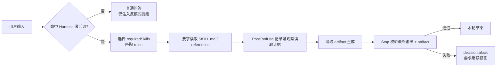
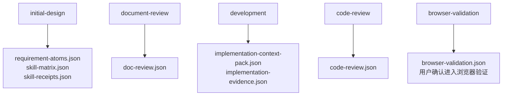
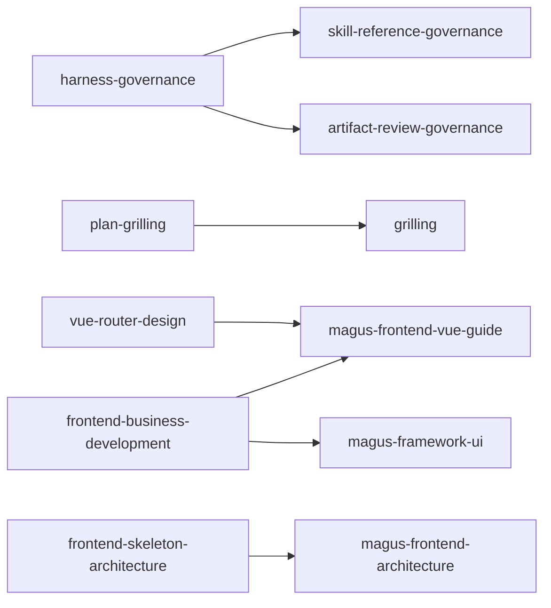
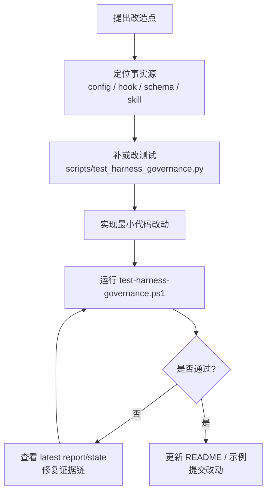

# Codex Harness Hook Testbed

这是一个用于验证 Codex Hooks / Harness 治理能力的本地测试仓库。它的核心目标不是生成某个业务系统，而是把 AI 开发过程中的“技能选择、技能读取、阶段产物、最终输出、评审验证”变成可审计、可阻断、可回放的工程证据链。

一句话理解：这个仓库把“模型说它遵守了规范”升级为“Hook 能看到它读了哪些文件、产出了哪些 artifact、最终回答是否满足门禁”。

## 仓库能力

- **技能门禁**：根据用户 prompt 和显式 Harness 激活词选择必读技能。
- **读取证据审计**：通过 `PostToolUse` 捕获真实文件读取内容，避免只靠“我已阅读”的自证。
- **阶段门禁**：对 `initial-design`、`document-review`、`development`、`code-review`、`browser-validation` 等阶段检查必需 artifact。
- **输出门禁**：检查最终回答是否包含技能要求、阶段要求和 `技能使用证据`。
- **反模式注入**：每轮注入 AI 反模式提醒，降低概率补全、伪造闭环、未验证确定语气等风险。
- **本地验证**：提供 PowerShell 与 Python smoke 测试，覆盖配置解析、schema 解析、hook 函数行为和阶段阻断。
- **前端样例工程**：`magus-menu-ui/` 是 Vue 3 + Magus UI 样例，用于验证技能规范在真实前端骨架中的落地方式。

## 设计理念

Harness 的设计重点是“证据优先”，而不是“提示词更强”。它默认 AI 的自然语言承诺不可靠，所以把关键行为转成文件化、结构化、可检查的证据。



核心边界：

- Hook 不能读取模型内部“是否真的加载了技能”的隐藏状态。
- 本仓库只信可观察证据：工具输出、真实文件内容、结构化 artifact、最终回答中的必含字段。
- 普通聊天不应被 Harness 误伤；规则匹配和阶段识别必须先经过 `activationPhrases`。
- 浏览器验证是显式阶段，必须有用户确认，不能由最终回答自证。

## Harness 流程

| Hook | 入口 | 主要职责 | 主要产物 |
|---|---|---|---|
| `UserPromptSubmit` | 用户提交 prompt 后 | 注入反模式提醒；判断是否 Harness 激活；匹配 `rules`；识别阶段；列出必读技能和验收卡片 | `.codex/hook-state/skill-gate/*.json`、`.codex/hook-logs/latest-skill-gate-report.json` |
| `PostToolUse` | 工具调用后 | 从工具输入/输出中检查是否出现真实技能文件内容；合并读取证据 | `readEvidence`、`skill-gate-events.jsonl` |
| `Stop` | 助手准备结束时 | 校验必读技能、最终回答短语、阶段 artifact、schema、浏览器确认；失败时阻断 | 通过时静默；失败时返回 `decision: block` |

阶段门禁由 `.codex/skill-gate.config.json` 的 `phaseGates` 定义：



当前重要阶段 artifact：

- `.codex/harness/artifacts/requirement-atoms.json`
- `.codex/harness/artifacts/skill-matrix.json`
- `.codex/harness/artifacts/skill-receipts.json`
- `.codex/harness/artifacts/implementation-context-pack.json`
- `.codex/harness/artifacts/implementation-evidence.json`
- `.codex/harness/artifacts/browser-validation.json`

## Hooks 能力说明

Hook 配置入口是 `.codex/hooks.json`。三个事件都执行同一个脚本：`.codex/hooks/skill_gate.py`。

Windows 下通过 `commandWindows` 设置 UTF-8 输出，避免中文 hook 输出乱码。Python 脚本输出 JSON 时使用 ASCII-safe 编码，Stop 通过时保持静默，避免 Codex 把普通提示误判为非法 Stop 响应。

主要实现函数：

| 函数 | 作用 |
|---|---|
| `is_harness_activated()` | 判断 prompt 是否包含显式 Harness 激活词 |
| `select_required_skills()` | 根据 `rules[].whenPromptMatches` 与显式 `$skill` 选择必读技能 |
| `detect_phase()` | 识别当前阶段；浏览器验证带否定、讨论、疑问时不会误触发 |
| `scan_available_skills()` | 从当前目录、父目录、用户目录等位置发现 `skills/*/SKILL.md` |
| `evidence_hit()` | 判断工具输出是否包含真实技能文件路径和正文片段 |
| `build_skill_receipts()` | 从读取证据生成技能收据 |
| `validate_phase_artifacts()` | 检查阶段必需 artifact 是否存在并满足字段约束 |
| `validate_final_output()` | 检查最终回答必含短语、禁用短语、证据小节和用户确认 |
| `handle_user_prompt_submit()` | 第一道门实现 |
| `handle_post_tool_use()` | 第二道门实现 |
| `handle_stop()` | 第三道门实现 |

## 代码地图

```text
.
├─ README.md                         # 本说明
├─ AGENT.md                          # 本仓库统一中文回答约束
├─ .codex/
│  ├─ hooks.json                     # Codex hook 注册入口
│  ├─ skill-gate.config.json         # 规则、技能、阶段、schema、输出门禁配置
│  ├─ hooks/skill_gate.py            # Harness hook 主实现
│  ├─ harness/
│  │  ├─ anti-patterns.md            # 每轮注入的反模式提醒
│  │  ├─ schema/*.schema.json        # artifact 字段约束
│  │  ├─ artifacts/*.json            # 当前阶段样例/运行产物
│  │  └─ examples/                   # pass/fail 示例 artifact
│  ├─ hook-logs/                     # 最新报告、事件流、debug 日志
│  └─ hook-state/skill-gate/         # 按 session/turn 保存的门禁状态
├─ scripts/
│  ├─ test-harness-governance.ps1    # 总 smoke 测试入口
│  ├─ test_harness_governance.py     # Python 函数级断言
│  ├─ test-local.ps1                 # 本地三道门模拟
│  └─ show-report.ps1                # 查看最新 report 和 state
├─ skills/
│  ├─ skill-reference-governance/    # 技能选择、读取、收据、ruleId 约束
│  ├─ artifact-review-governance/    # issue-level review 与验证 artifact 约束
│  ├─ grilling/                      # 计划/设计压测追问，一次只问一个问题
│  ├─ magus-frontend-architecture/   # 新建前端骨架与 init-skeleton 协议
│  ├─ magus-frontend-vue-guide/      # Magus Vue 3 业务模块规范
│  └─ magus-framework-ui/            # Magus UI 组件选择与事实源
├─ docs/
│  ├─ plans/                         # 业务/前端计划文档
│  └─ superpowers/plans/             # Harness MVP 计划记录
└─ magus-menu-ui/
   ├─ package.json                   # Vue 3 + Vite + Magus UI 样例工程
   ├─ vite.config.ts                 # 文件式路由、自动导入、Magus resolver、proxy
   └─ src/
      ├─ pages/menu/index.vue        # 菜单管理样例页面
      ├─ api/menu/                   # 菜单 API 契约占位与类型
      ├─ layouts/                    # 默认布局、侧边栏、导航
      └─ router/index.ts             # auto-routes + wujie 主路由
```

## 配置地图

`.codex/skill-gate.config.json` 是规则事实源，常用字段如下：

| 字段 | 说明 | 修改风险 |
|---|---|---|
| `activationPhrases` | Harness 显式激活词 | 过宽会导致普通聊天误触发 |
| `rules[]` | prompt 关键词到 requiredSkills 的映射 | 新增技能时必须同步 `skills` |
| `skills.<id>.requiredReadFiles` | 每个技能必须读取的文件 | 路径必须真实存在 |
| `skills.<id>.outputMustContain` | 最终回答必含短语 | 过度要求会造成无意义阻断 |
| `skills.<id>.outputMustNotContain` | 最终回答禁用短语 | 注意否定语境由 `allowNegatedForbiddenPhrases` 处理 |
| `phaseGates` | 阶段必需 artifact 与最终回答短语 | 修改后要补测试和 schema |
| `artifactSchemas` | artifact schema 路径 | schema key 与文件名映射由代码维护 |
| `phaseTransitions` | 阶段转换附加条件 | 浏览器验证依赖用户来源确认 |

技能和规则关系：



当前规则匹配仍以关键词为主，但 Harness 规则只有在命中 `activationPhrases` 后才参与选择；显式 `$skill-name` 是另一条直接路径。

## 本地运行与验证

查看最新报告：

```powershell
.\scripts\show-report.ps1
```

运行完整 smoke 测试：

```powershell
.\scripts\test-harness-governance.ps1
```

测试覆盖点：

- 配置 JSON 可解析。
- schema 与示例 artifact 可解析。
- `detect_phase()` 不误触发讨论类/否定类浏览器验证文本。
- review 不能用空数组或 self-review 冒充独立 no-findings。
- 技能读取证据不能只靠路径、metadata 或最终回答自证。
- 阶段 artifact 缺失时持续阻断。
- 本地三道门模拟可执行。

单独模拟三道门：

```powershell
.\scripts\test-local.ps1
```

## 修改升级注意事项

1. **先改配置，再改代码，最后补测试。** 规则、技能、阶段的事实源在 `.codex/skill-gate.config.json`；Hook 代码只实现通用机制。
2. **新增技能必须四处对齐。** 至少检查 `skills/<id>/SKILL.md`、`config.skills.<id>`、相关 `rules[].requiredSkills`、`requiredReadFiles` 路径。
3. **不要放宽读取证据。** `acceptTranscriptEvidence=false`、`acceptFinalClaimAsEvidence=false` 是为了防止最终回答自证；修改前要有明确理由。
4. **普通聊天必须保持不触发。** 新增关键词时先确认是否仍受 `activationPhrases` 保护。
5. **阶段 artifact 是硬门禁。** 新增阶段或字段时，同步 schema、`validate_*` 函数、测试断言和 README。
6. **Stop 通过时必须静默。** 不要在通过分支返回说明性 JSON，否则 Codex 可能把 Stop 响应判为非法。
7. **Windows 编码要保守。** Hook stdout 继续使用 ASCII-safe JSON；PowerShell 脚本继续设置 `$OutputEncoding` 和 `[Console]::OutputEncoding`。
8. **浏览器验证不能自我确认。** 只能由用户输入触发确认，最终回答包含确认短语不等于用户确认。
9. **前端样例不得虚构契约。** 菜单 API、权限码、DTO、响应结构未确认时，继续保持 blocked/contract-missing 状态。
10. **生成目录和运行产物要分清。** `.codex/hook-logs/`、`.codex/hook-state/` 是运行证据；`skills/`、schema、hook 脚本才是维护重点。

## 推荐改造流程



最小验收标准：

- `.\scripts\test-harness-governance.ps1` 通过。
- `.\scripts\show-report.ps1` 能看到最新 report/state。
- 新增或修改的规则能解释：触发条件、requiredSkills、必读文件、阶段 artifact、最终输出要求。
- 没有把用户未确认的信息写成确定事实。

## 常见问题

**为什么普通 prompt 没有命中技能？**

因为当前规则要求先命中 `activationPhrases`，例如 `根据Harness规范`。这是为了避免普通聊天被门禁误伤。

**为什么已经在最终回答写“已读取技能”仍然阻断？**

因为默认不接受最终回答自证。必须通过工具真实读取 `SKILL.md` 或 required references，并让 `PostToolUse` 捕获到路径和正文片段。

**为什么阶段 artifact 缺失时第二次 Stop 还会阻断？**

这是预期行为。`avoidInfiniteStopLoop` 只避免纯输出短语问题无限阻断；缺技能读取或缺阶段 artifact 属于硬缺口，必须补齐。

**为什么浏览器验证不能直接开始？**

浏览器验证会产生截图、console、network 等强验证 artifact，属于显式阶段。必须先告知用户并等待用户确认。
